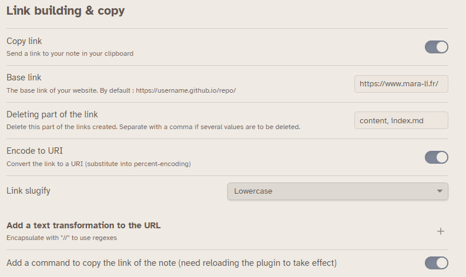

## Sharing config


<u>Share all files</u> allows to send every files automatically (unless they are excluded) without using the `share` key.
When enabled, you can excluded all files where the name start by something.


### Share key

Set the share key and set it to `true` in the YAML frontmatter of a note to allow sharing it. By default, it is `share`. For example:

```
---
share: true
---

This note will be shared.

```

### Excluded folders

Even if the share key is set to `true` in notes inside excluded folders, they won't be shared. This is useful if you forget to remove the `share` (or turn it to `false`) and move a file in your archive.

You can use regex here, but you need to enclose the regex between `/`, e.g. `/unshar.*/`.

The path should be relative to the root (e.g. `./excluded`). If only the name is provided, it will exclude all folders **containing** the keyword.

## Menu

Add the command to share the file on the file menu (right-click on a file in the explorer or using the three dots) and editor menu (right-click on an open edited note)

> [!note] The right-click menu command can also send the file under your cursor if it's a link!

## Link building & copy



Add the link's shared note in your clipboard after sharing :

- You can set the baselink (note : this can be edited by per-file settings `baselink`).
- You can also delete some part of the created link. If you need to remove multiple part, just separate the part with a comma. For example, if you want to remove the extension and the index : `index, .md`
- You have the option to enable a new command in the command palette to create a link to the current opened file. If you want to add in the right-click menu, you can use the [commander](https://github.com/phibr0/obsidian-commander) plugin.
- You can choose to disable or enable the encoding URI and also the slugify (strict, disabled or lowercase).
- It is also possible to add a text transformation to the URL. As always, regex needs to be enclosed between `/`. For example, if you want to replace all spaces, you can use `/ /g`.

## Others


### Show what files are edited, added, or deleted after uploaded

This is how the modal look like:


### Save tabs

Allow to quickly return to the last used tabs of the settings after closing the settings and reopen it.

## Logs


1. <u>Notice every error :</u>You can notify all error in a notice, instead of the console. This option is useful if you don't know how to use the console, and if you debug on mobile.
2. <u>Display developper logs</u> : Will send some informations in the console logs. If the previous was enabled, the logs will be send as a Notice instead.

---
